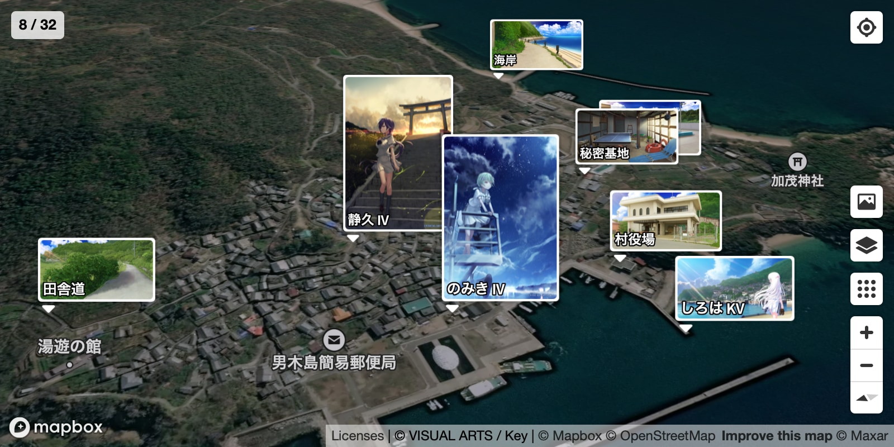
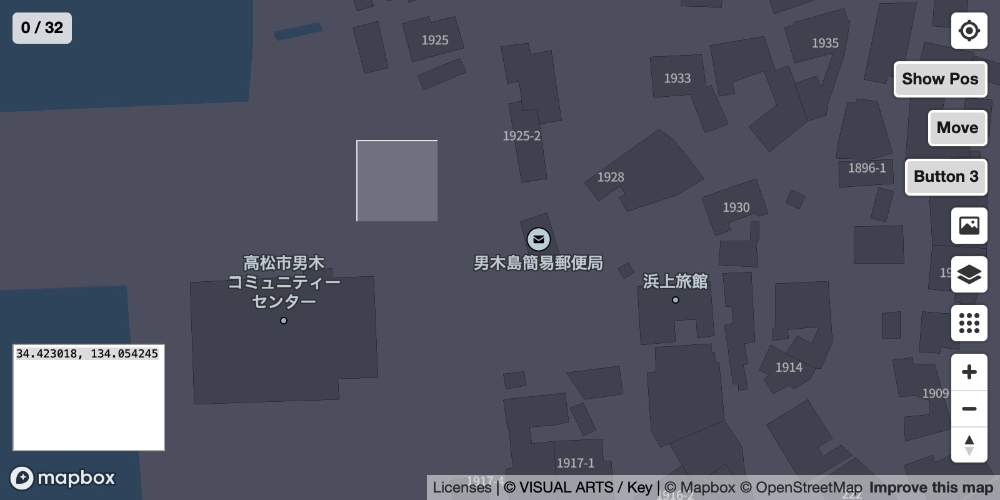

# seichi-map
聖地巡礼に便利なマップを作成するキット

## 概要
- 地図上に画像とラベルを表示するブラウザアプリです。
- JSONファイルと画像を用意するだけでマップが作れます。
- GPSと方位検出に対応しているため、現地で使用できます。
- ファイル名からラベルを自動生成します。（例: ep1m2s34.jpg → "1話 2:34"）

## デモ
https://chabu.sakura.ne.jp/common/map.html?base=/2022/11/08/summer-pockets/



## 必要な物
- Mapboxアカウント、アクセストークン（共に無料）
- 静的サイトホスティング環境（レンタルサーバー、Amazon S3等）

## 設置方法
- 地図の表示に必要なファイルを展開します。
  - 例: /
    - map.html（アクセストークンを書き換えてください）
    - map.css
    - mapbox.js
    - licenses.txt
- 聖地マップ1つにつき、1つのディレクトリを作成します。
  - 例: /sample_dir/
    - map.json（必須）
    - ep1m2s34.jpg（マーカーに使う画像）
    - thumbs/ep1m2s34.jpg（非必須サムネイル、転送量削減用途）
- http://localhost/map.html?base=/sample_dir/ のように、絶対パスで[^1]指定して開きます。
### JSONフォーマット
- points 配列
  - `orig`が存在すれば、クリックでそちらを表示します。
  - `away`が`true`であれば、初期状態で表示しません。
  - `latlng`を空配列にすると、処理をスキップします。

```json
{
  "name": "作品タイトル",
  "copyrights": ["&copy; 権利者名"],
  "points": [
    {
      "latlng": [34.4205658, 134.0536327],
      "icon": "thumbs/kv.jpg",
      "orig": "kv.jpg",
      "text": "キービジュ"
    },
    {
      "latlng": [34.4568781, 133.9740912],
      "icon": "ep1m2s34.jpg"
    }
  ]
}
```

## 開発者モード
- マップのURLに`&dev`を付けると起動します。
- 任意の場所の座標が分かります。それだけです。
- 右クリックでマーカーを移動させ、白い部分をドラッグして調整します。



## その他
- Safari、Chromeで動作確認をしています。
- マーカーの個数は最大590個程度[^2]です。これより多く設置するとタブがクラッシュします。
- 1サムネイル毎に1リクエストが送信されます。HTTP/2であれば多分大丈夫だと思います。
- このキットの命名規則に対応した、動画のキャプチャツール（Chrome拡張）も公開中です。
  - https://github.com/chabu/video-screenshot

## 参考
- https://docs.mapbox.com/mapbox-gl-js/example/add-image/
- https://developer.mozilla.org/ja/docs/Web/API/Canvas_API

## コントリビュート
- forkして各々が使いやすいよう改変してください。
- Issueは致命的な不具合のみ対応します。

[^1]: アクセストークンの無断使用を防ぐため、JavaScript側で絶対パス以外は簡易的に弾いています。
[^2]: 画像が16:9の時`4096^2 / (208 * (117+19)) = 593.08`。背景が多いアニメだと1クールで300カットくらいです。
